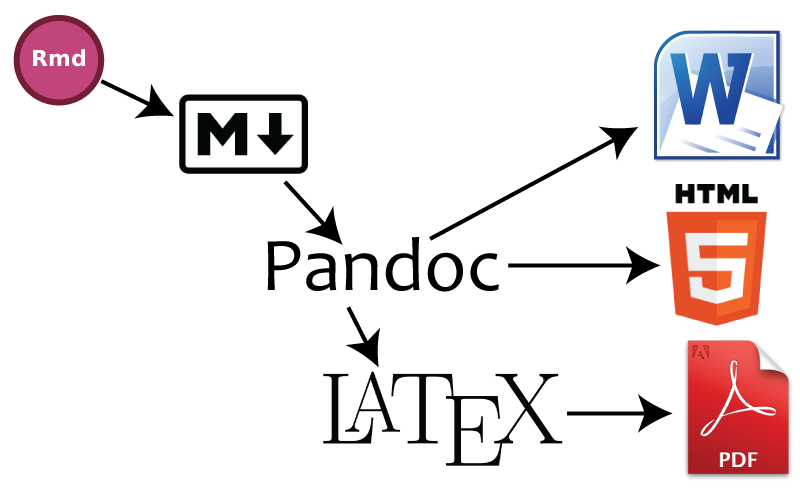

<style type="text/css">
  /* I'm cheating here. The ioslides pipeline wants to treat every h1 and h2
     in a special way, so I can't demo what they look like as a part of a page.
     I'm just emulating it here.*/
  #faux-h1 {
    font-size: 2em; margin: .67em 0;
  }
  
  #faux-h2 {
    font-size: 1.5em; margin: .75em 0;
  }
  
  #questions {
    text-align: center;
    font-size: 2em;
    padding-top: 1em;
    padding-bottom: 2em;
  }
     
</style>

## What is Markdown?

 - A "plaintext formatting syntax"
 - Type in plain text, render to more complex formats
 - One step beyond writing a `txt` file
 - Render to HTML, PDF, etc.

## What does it look like?

<div class="columns-2">

```

# Header 1

## Header 2

Normal paragraphs of text go here.


**I'm bold**

[links!](http://rstudio.com)

 * Unordered
 * Lists   
 
And  Tables
---- -------
Like This

```


<div id="faux-h1">Header 1</div>

<div id="faux-h2">Header 2</div>

Normal paragraphs of text go here.

**I'm bold**

[links!](http://rstudio.com)

 * Unordered
 * Lists

And  Tables
---- -------
Like This


</div>


## What is R Markdown?
  
<div class="columns-2">
  
- "Literate programming"
- Embed R code in a Markdown document
- Renders textual output along with graphics

<div style="height: 15px"></div>

<hr />

<div style="height: 15px"></div>

<!-- Sorry for this hack. I couldn't figure out how to put three backticks in 
    an Rmd without it getting interpreted as a break for <code>, so I have 
    0-width unicode spaces between these inner backticks. Ace (RStudio) will 
    show them as red-dots. Other editors may not. -->
```
```{r}
x <- rnorm(100)
length(x)
hist(x)
```
```

<div style="height: 100px"></div>

```{r, fig.width=4, fig.height=3}
x <- rnorm(100)
length(x)
hist(x)
```

</div>


## Pipeline -- rmarkdown v1


# Rmd to HTML Example

## Pipeline -- rmarkdown v1


## Pipeline -- rmarkdown v2



# Rmd to Word Example

## Output Formats

  - Many already defined
    - MS Word docx
    - HTML
    - LaTeX
  - Can define a custom format 

## Templates & Custom Formats

  - Predefined arrangement for a document
    - Can be entirely novel
    - Or can extend existing formats (e.g. HTML)

## Custom Template Example

  - Provide some scaffolding for an existing format
  - Add some CSS styling, images, or scaffolded content
  - Still just generating an (e.g.) HTML document
  
## Custom Format Example

  - Can generate Beamer (via LaTeX), reveal.js, or ioslides presentations

## Custom Format Example

  - Create LaTeX templates to generate structured PDFs
  - The `rticles` pacakge has a few interesting examples
    - JSS
    - useR! abstract
    - R Journal


## Add Interactivity (Shiny)

  - Not only static documents
  - Can create interactive, runnable HTML documents using Shiny

## Resources

  - Download the latest RStudio ([here](http://www.rstudio.com/products/rstudio/))
  - File > New File > R Markdown
  - [http://rmarkdown.rstudio.com/](http://rmarkdown.rstudio.com/)
  
Slides at <http://rpubs.com/trestletech/usermd>

