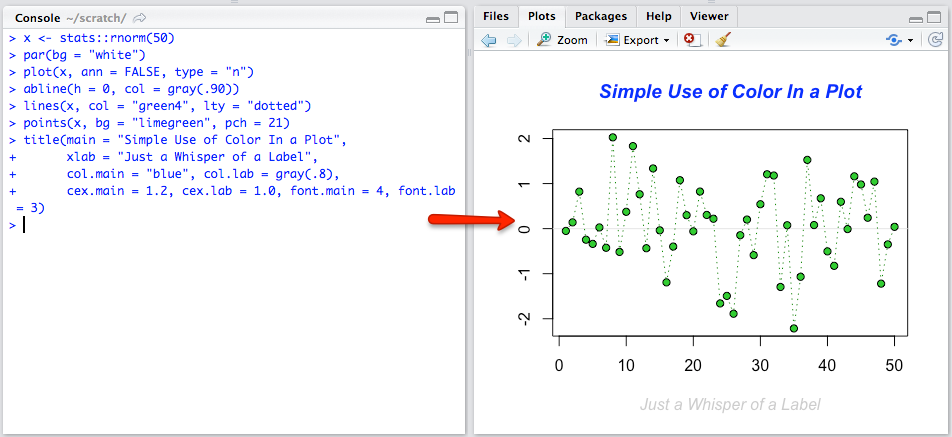
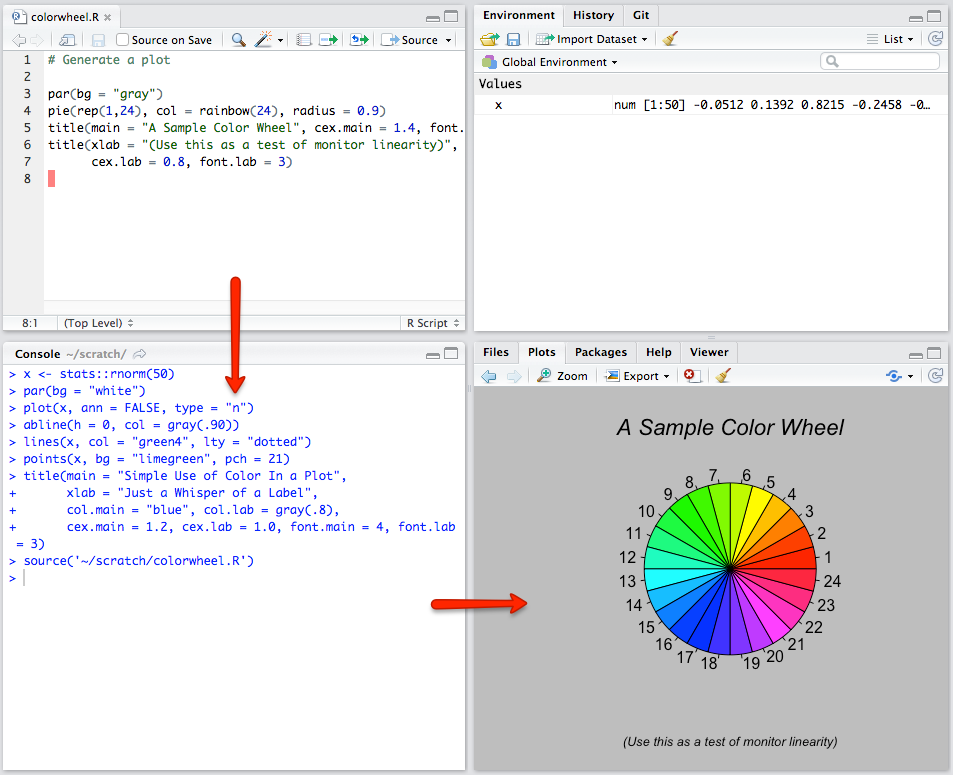
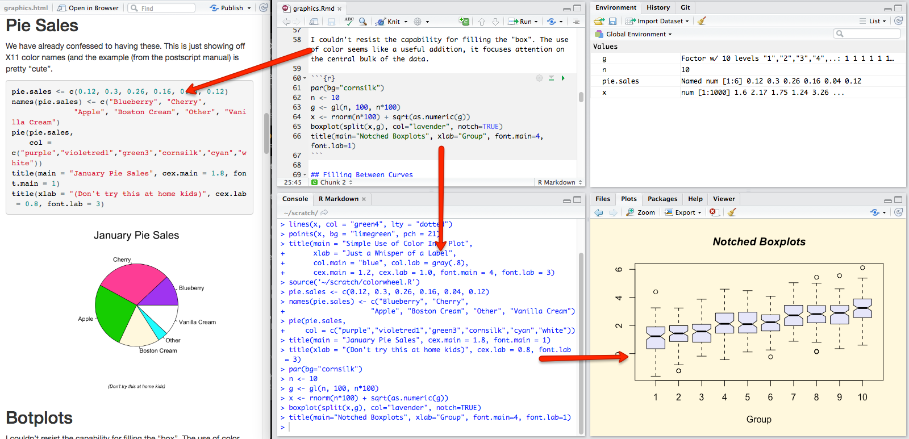
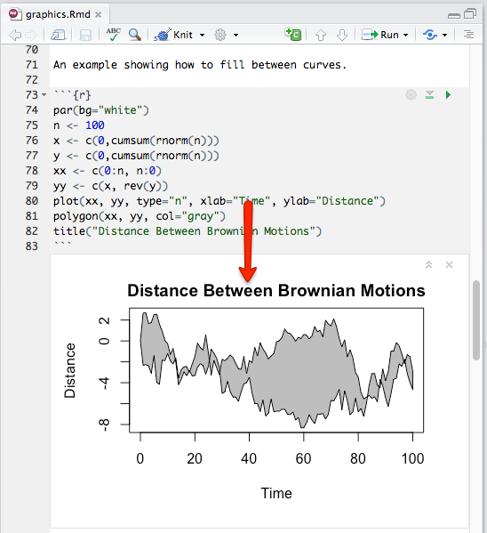

## Outline

1. Background: Data Analysis Workflow
2. R Notebooks
3. Demo
4. Q&A

## Level 1: Typical new R analyst 

New R users often just work in the console. They have an ad-hoc conversation with R. This is fine for early exploratory analysis, but it has a serious drawback: it is not reproducible. It's hard to see what you did, what the output was, and why you did it. 

## Level 2: Experienced R analyst

This is where most R users are today. Instead of writing R code in the console, you write it in the script editor. This is much better because your analysis is now documented and repeatable and shareable. It still has a couple of flaws, though:

- R output is disconnected from input; has to be saved separately
- Export/copy/paste needed for final use
- Documentation and context are usually sparse or absent

## Level 3: Literate R analyst

R Markdown is a tool for composing data analaysis using literate programming. We won't focus on it much in this presentation, but it solves all of the above problems. It lets you write a document that includes runnable R code, and create a polished, professional output document. R Markdown alone can be frustrating to use for data analysis, though:

- Iterating on code is no better than it was in level 2 -- you still need to keep the console and viewer windows open
- Look at how complex this is getting!

## Level 4: Introducing R Notebooks

A goal of R Notebooks is to give you all the power of R Markdown with all of the immediacy and fun you had back at level 1. In an R Notebook, you can write your analyses and see the results, in real time, below the code.

## R Notebooks Summary

1. Interact with R in a **single, seamless stream**.
1. **Iterate quickly** on code and output; see code and output together. 
1. Leave a **clean, reproducible record** of your analysis in a simple text file.
1. Document your analysis with **rich, literate prose**.
1. **Share and publish** easily.
1. **One-click export** to PDF, Word, etc.

# Demo

Everything here is only in the RStudio preview. 

1. Basic console output

2. Graphics output

3. HTML widgets

4. The execution model

4a. Green status indicator

4b. Alternate engines

5. Dealing with errors

6. .nb.html file

6a. preview on save

6b. sharing 

6c. opening in IDE 

7. alternate formats

8. new notebook

## Compared with Jupyter

- Different interaction model (cells vs. text)
- First-class support for R, some support for other "kernels"
- Plain text format is more amenable to version control
- No special viewer required 
- Cross-render to final output

## Advanced topics

- Execution queue control
- Notebooks in RStudio Server
- Version control
- Rendering & hooks from other R front ends

## R Notebooks Summary

1. Interact with R in a **single, seamless stream**.
1. **Iterate quickly** on code and output; see code and output together. 
1. Leave a **clean, reproducible record** of your analysis in a simple text file.
1. Document your analysis with **rich, literate prose**.
1. **Share and publish** easily.
1. **One-click export** to PDF, Word, etc.

## Links

- RStudio Preview: https://www.rstudio.com/products/rstudio/download/preview/

- R Notebooks: http://rmarkdown.rstudio.com/r_notebooks.html

## Q&A
