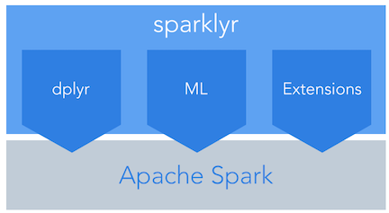

# sparklyr webinar

These scripts are companion material for the sparklyr webinar. The sparklyr webinar describes how to use R and [Apache Spark](http://spark.apache.org/) with the new [sparklyr](http://spark.rstudio.com) package from RStudio. For a complete set of scripts see the [sparkdemos](https://github.com/rstudio/sparkDemos) github repository. There is also a nice set of [examples](http://spark.rstudio.com/examples.html) on the main site.

## Example scripts

Three scripts are referenced in the webinar. If you install the sparklyr package the first two can be reproduced in local mode. The third script will only run on a Spark cluster with preprocessed data loaded into Hive, therefore it is here for instructional purposes only.

1. [Initialize](01_initialize.Rmd) a spark connection and load data into it
2. Run sparklyr using [dplyr](02_dplyr.Rmd) in local mode
3. Analyze 1 billion records in a Spark cluster the [NYC taxi data](03_taxiDemo.Rmd) 

## Questions and answers

We had a lot of great questions during the video and we were not able to answer all of them. I have gone through and tried to answer each question below. If you have more questions, please submit questions to this [google group](https://groups.google.com/forum/#!forum/sparklyr). If you have issues with the software, please submit them to the [github repos](https://github.com/rstudio/sparklyr). 

* [Questions and answers](QA.md) from the webinar