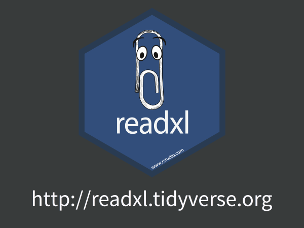

## [readxl](http://readxl.tidyverse.org) webinar

2017-05-10, given by Jenny Bryan

PDF of slides:

  * Here in this repo: [2017-05-10_readxl-rstudio-webinar.pdf](2017-05-10_readxl-rstudio-webinar.pdf)
  * On [SpeakerDeck](https://speakerdeck.com/jennybc/readxl-rstudio-webinar)
  
Related material:

  * A recording is available from [RStudio's webinar home](https://www.rstudio.com/resources/webinars/)
  * R code from live demo: [2017-05-10_readxl-rstudio-webinar.R](2017-05-10_readxl-rstudio-webinar.R)
  
