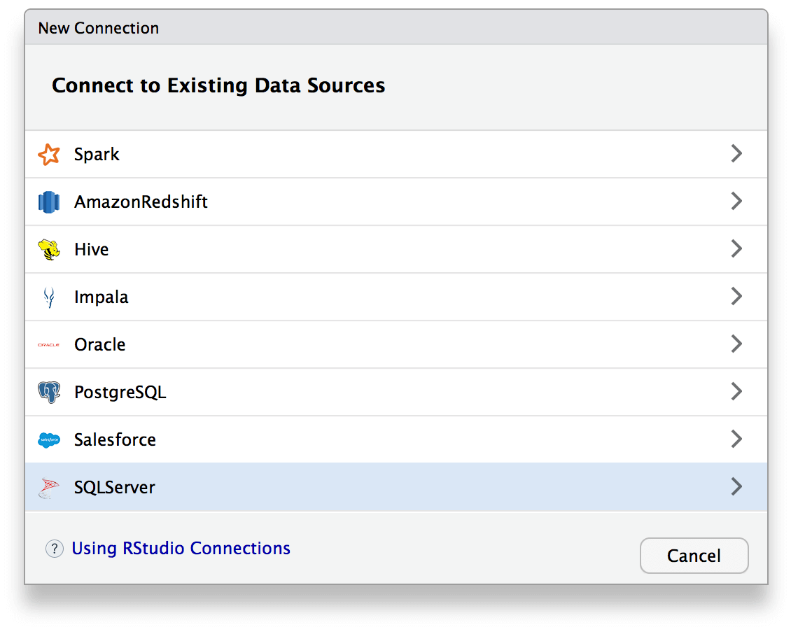

### RStudio connection wizard

The RStudio IDE will automatically detect specific database connections that are set up on your system. There are four ways to set up connections that will automatically populate in the new connection dialog. The four methods are:

1. ODBC drivers
2. Data source names (DSN)
3. R Snippets
4. R Packages




## 1. ODBC drivers

If the odbc package is installed, any ODBC driver you have installed will be listed. ODBC drivers are typically listed in the `odbcinst.ini` file. Connections are written with authentication arguments. Notice here the password is obscured with the `askForPassword()` function in the `rstudioapi` package.


```{r}
library(DBI)
con <- dbConnect(odbc::odbc(),
                 Driver = "PostgreSQL",
                 Database = "airontime",
                 Port = "5432",
                 Server = "postgres-demo.cihykudhzbgw.us-west-2.rds.amazonaws.com", 
                 UID = "parzival", 
                 PWD = rstudioapi::askForPassword("Database password")
                 )
dbListTables(con)
```

Alternatively, you can hide your credentials by storing them in `.Renviron` located in your home directory.

```{r}
con <- dbConnect(odbc::odbc(),
                 Driver = "PostgreSQL",
                 Database = "airontime",
                 Port = "5432",
                 Server = "postgres-demo.cihykudhzbgw.us-west-2.rds.amazonaws.com", 
                 UID = Sys.getenv("uid"), 
                 PWD = Sys.getenv("pwd")
                 )
dbListTables(con)
```


## 2. Data source names (DSN's)

ODBC DSN's installed on your system. If the odbc package is installed, any system DSN (Data Source Name) you have installed will be listed. DSN's are typically stored in the `odbc.ini` file.

```{bash}
head -6 /etc/odbc.ini
```

You can refer to your DSN's by name.

```{r}
con <- dbConnect(odbc::odbc(), "postgresql")
dbListTables(con)
```

## 3. Snippets

An administrator may put connection snippets into a folder to make them available to end users. Snippets are typically located under `/etc/rstudio/connections`. You can write custom R code specifying your connection format and store it as a snippet. For example, you can use a snippet to prepopulate all the authentication arguements in a connection.

```{bash}
ls -al /etc/rstudio/connections
```

```{bash}
cat /etc/rstudio/connections/PostgreSQL.R
```

## 4. R Package

Any R package can supply a connection. Currently, the sparklyr package and odbc package define connection types. Package owners can write new [connection contracts](https://rstudio.github.io/rstudio-extensions/connections-contract.html) that will automatically be detected by the RStudio IDE.

