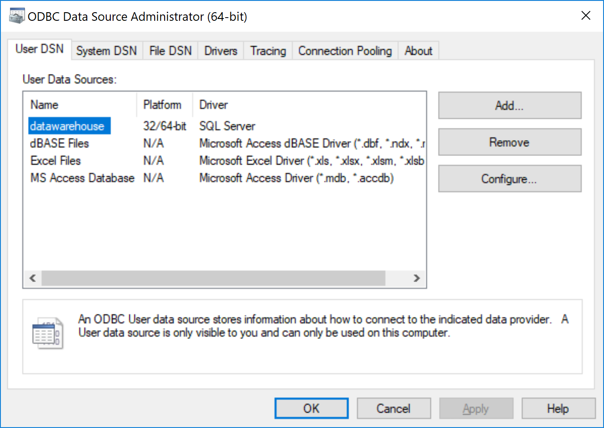
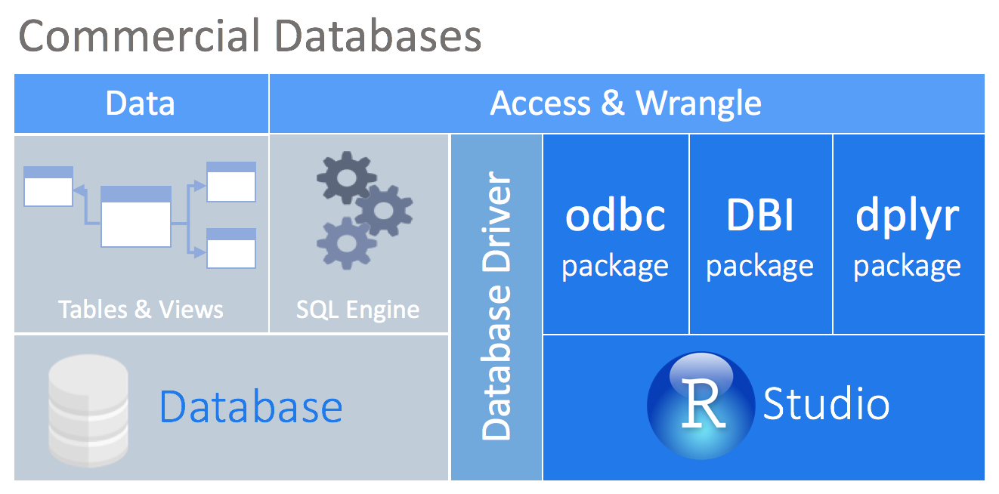

## Connecting to a database

```{r}
library(knitr)
include_graphics(("images/drivers.PNG"))
```

```{r}
library(odbc)

odbcListDrivers()
sort(unique(odbcListDrivers()[[1]]))
```

http://db.rstudio.com/best-practices/managing-credentials/#integrated-security-without-dsn

http://db.rstudio.com/databases/microsoft-sql-server/

```{r}
library(DBI)

con <- dbConnect(odbc(), 
                 Driver = "SQL Server", 
                 Server = "localhost\\SQLEXPRESS", 
                 Database = "datawarehouse", 
                 Trusted_Connection = "True")
```

```{r}

```


http://db.rstudio.com/best-practices/managing-credentials/#integrated-security-with-dsn

```{r}
con <- dbConnect(odbc(), "datawarehouse")
```


## Using DBI

http://db.rstudio.com/dbi/

```{r}

```

```{r}
dbGetQuery(con, "select dest, count(*) from production.flights group by dest")
```

```{sql, connection = con}
select "origin", count(*) from production.flights group by "origin"
```


## dplyr

http://db.rstudio.com/dplyr/

```{r}
library(dplyr)
library(dbplyr)

tbl(con, in_schema("production", "flights"))

#tbl(con, "production.flights")
```

```{r}
db_flights <- tbl(con, in_schema("production", "flights"))
```

```{r}
db_flights %>%
  head()
```

### Under the hood

```{r}
db_flights %>%
  head() %>%
  show_query()
```

```{r}
sql_render(head(db_flights), con = simulate_mysql())
```

Translations available in `dbplyr`:

- Microsoft SQL Server
- Oracle
- Teradata 
- Amazon Redshift 
- MS Access 
- Apache Hive
- Apache Impala
- PostgreSQL
- MariaDB (MySQL)
- SQLite

BigQuery - Available in `bigrquery` - http://db.rstudio.com/databases/big-query/
MonetDB - Available in MonetDBLite - http://db.rstudio.com/databases/monetdb/


### More dplyr

```{r}
db_flights %>%
  group_by(year) %>%
  tally() 
```

Create summarizations
```{r}
db_flights %>% 
  group_by(month) %>%
  summarise(
    no_flights = n(),
    avg_dep_delay = mean(depdelay, na.rm = TRUE),
    avg_arr_delay = mean(arrdelay, na.rm = TRUE)
  )
```

Join tables 
```{r}
db_airports <- tbl(con, in_schema("production", "airports"))

db_joined <- db_flights %>%
  inner_join(db_airports, by = c("origin" = "faa")) 

db_joined
```

Top 10 busiest airports.  Take advantage of `dplyr` lazy evaluation
```{r}
db_joined %>%
  group_by(name) %>%
  tally() %>%
  arrange(desc(n)) %>%
  head(10)
```

## Visualization

http://db.rstudio.com/best-practices/visualization/

```{r}
library(ggplot2) 

t <- db_joined %>%
  group_by(name) %>%
  tally() %>%
  arrange(desc(n)) %>%
  head(10) %>%
  collect() 

  ggplot(t) +
  geom_col(aes(x = name, y = n)) +
  coord_flip()
  
```

```{r}
db_joined  %>%
  group_by(lon, lat) %>%
  tally() %>%
  select(n, lon, lat) %>%
  collect() %>%
  ggplot() +
    geom_point(aes(x = lon, y = lat, size = n, color = n), alpha = 0.3)
```

## Use dbplot

http://db.rstudio.com/dbplot/

```{r}
library(dbplot)

db_flights %>%
  filter(year == 2006) %>%
  dbplot_line(month , mean(arrdelay, na.rm = TRUE))
```

```{r}
db_bin(my_var)
```

```{r}
db_flights %>%
  filter(!is.na(arrdelay)) %>%
  dbplot_histogram(arrdelay)
```

```{r}
db_flights %>%
  filter(arrdelay < 100, arrdelay > (-100)) %>%
  dbplot_histogram(arrdelay)
```


```{r}
db_joined %>%
  filter(cancelled == 0) %>%
  dbplot_raster(depdelay, arrdelay)
```

```{r}
db_flights %>%
  filter(depdelay < -1000) %>%
  head(10)
```

Use View()
```{r, eval = FALSE}
db_flights %>%
  filter(depdelay < -1000) %>%
  head(100) %>%
  collect() %>%
  View("Over1K")

```

## Sampling

```{r}
set.seed(100)
rows <- db_flights %>%
  filter(cancelled == 0 , year == 2006) %>%
  tally() %>%
  pull()

sampling <- sample(1:rows, 600)
```

```{r, eval = FALSE}
flights_sample <- db_flights %>%
  filter(cancelled == 0 , year == 2006) %>%
  arrange(dayofmonth) %>%
  mutate(row = row_number()) %>%
  filter(row %in% sampling) %>%
  collect()
```

```{r}
flights_sample <- db_flights %>%
  filter(cancelled == 0 , year == 2006) %>%
  mutate(row = row_number(order = dayofmonth)) %>%
  filter(row %in% sampling) %>%
  collect()
```

```{r}
flights_sample %>%
  filter(arrdelay < 100, arrdelay > (-100)) %>%
  dbplot_histogram(arrdelay)
```

## Modeling

```{r}
model <- flights_sample %>%
  filter(arrdelay < 100, arrdelay > (-100)) %>%
  mutate( dayofmonth = paste0("d", dayofmonth)) %>%
  lm(arrdelay ~  crsdeptime + crsarrtime,  data = .)

summary(model)
```

## tidypredict

```{r}
library(tidypredict)

library(DBI)

?dbWriteTable

tidypredict_sql(model, con)
```

```{r}
db_flights %>%
  filter(arrdelay < 100, arrdelay > (-100), year == 2007) %>%
  tidypredict_to_column(model) %>%
  select(fit, arrdelay)
```

```{r}
db_flights %>%
  filter(arrdelay < 100, arrdelay > (-100), year == 2007) %>%
  tidypredict_to_column(model) %>%
  mutate(diff = fit - arrdelay) %>%
  dbplot_histogram(diff)

db_flights %>%
  filter(date >= unix_time_stamp(now()))
```

## Setup the local database

1. Download Microsoft SQL Server Express edition here: https://www.microsoft.com/en-us/sql-server/sql-server-editions-express

2. Download and read the data
```{r, eval = FALSE}
library(readr)
library(dplyr)
library(R.utils)
library(parallelMap)

if(!file.exists("data"))dir.create("data")

get_year <- function(year){
  bz2_file <- paste0("data/", year, ".csv.bz2")
  csv_file <- paste0("data/", year, ".csv")
  
    if(!file.exists(bz2_file)){
      download.file(
        paste0("http://stat-computing.org/dataexpo/2009/", year, ".csv.bz2"),
        paste0("data/", year,".csv.bz2")
        )
    }
  if(!file.exists(csv_file)){
    R.utils::bunzip2(bz2_file, remove = FALSE)
  }
  parallelStartSocket(4)
    f <- function(i) readr::read_csv(
      csv_file, 
      col_names = FALSE,
      skip = (i  * 2000000) - 2000000 + 1, 
      n_max = 2000000
      )
    y <- parallelMap(f, 1:4)
  parallelStop()
  
  flights <- bind_rows(y)
  rm(y); rm(f)
  
  col_names <- read_csv(csv_file, n_max = 1) %>%
    colnames() %>%
    tolower()
  colnames(flights) <- col_names
  flights
}

flights <- get_year(2006) %>%
  bind_rows(get_year(2007))
```

3. Create the database, schema and tables. Load the data. 
```{r, eval = FALSE}
library(odbc)
library(DBI)
library(dplyr)

con <- dbConnect(odbc(), 
                  Driver = "SQL Server", 
                  Server = "localhost\\SQLEXPRESS", 
                  Database = "master", 
                  Trusted_Connection = "True")

dbSendQuery(con, "CREATE DATABASE datawarehouse")
dbDisconnect(con)

con <- dbConnect(odbc(), 
                  Driver = "SQL Server", 
                  Server = "localhost\\SQLEXPRESS", 
                  Database = "datawarehouse", 
                  Trusted_Connection = "True")

dbSendQuery(con, "CREATE SCHEMA production;")
dbWriteTable(con, SQL("production.flights"), flights)
dbWriteTable(con, SQL("production.airports") , nycflights13::airports)
rm(flights)

dbDisconnect(con)

# Run if the database needs to be deleted
#dbSendQuery(con, "DROP DATABASE datawarehouse")
```


