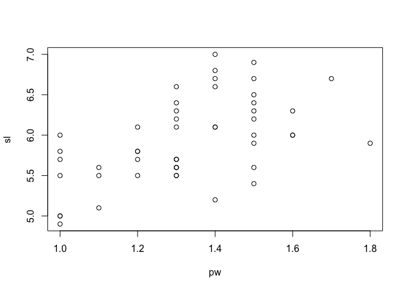
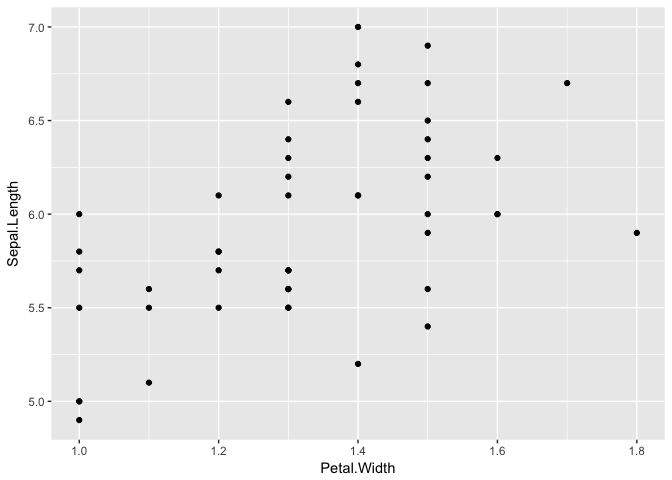
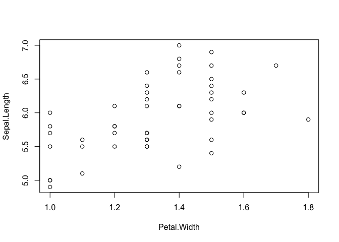

Leave your data in that big, beautiful data frame
================
Jenny Bryan
2018-04-02

## Don’t create odd little excerpts and copies of your data.

Code style that results from (I speculate) minimizing the number of key
presses.

``` r
## :(
sl <- iris[51:100,1]
pw <- iris[51:100,4]
plot(sl ~ pw)
```

<!-- -->

This clutters the workspace with “loose parts”, `sl` and `pw`. Very
soon, you are likely to forget what they are, which `Species` of `iris`
they represent, and what the relationship between them is.

## Leave the data *in situ* and reveal intent in your code

More verbose code conveys intent. Eliminating the Magic Numbers makes
the code less likely to be, or become, wrong.

Here’s one way to do same in a tidyverse style:

``` r
library(tidyverse)

ggplot(
  filter(iris, Species == "versicolor"),
  aes(x = Petal.Width, y = Sepal.Length)
) + geom_point()
```

<!-- -->

Another tidyverse approach, this time using the pipe operator, `%>%`

``` r
iris %>%
  filter(Species == "versicolor") %>%
  ggplot(aes(x = Petal.Width, y = Sepal.Length)) + ## <--- NOTE the `+` sign!!
  geom_point()
```

<!-- -->

A base solution that still follows the principles of

  - leave the data in data frame
  - convey intent

<!-- end list -->

``` r
plot(
  Sepal.Length ~ Petal.Width,
  data = subset(iris, subset = Species == "versicolor")
)
```

<!-- -->
