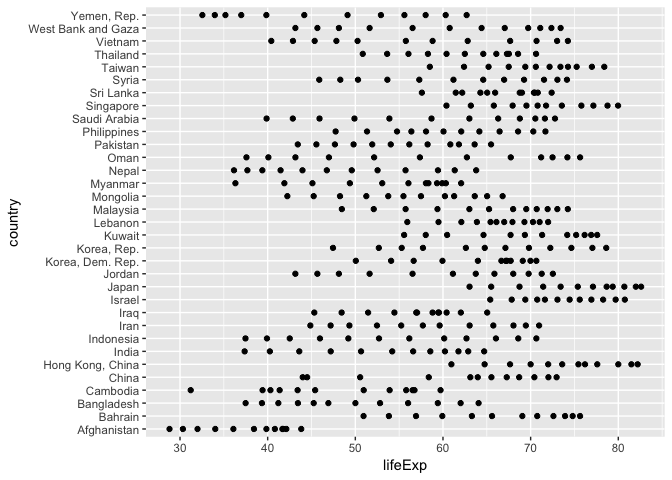
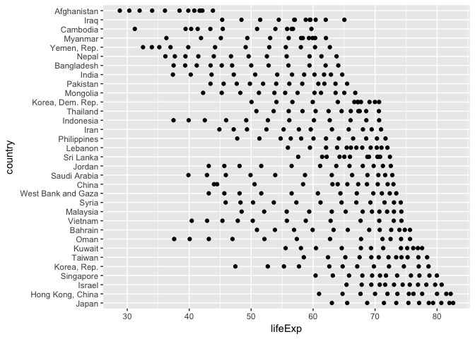
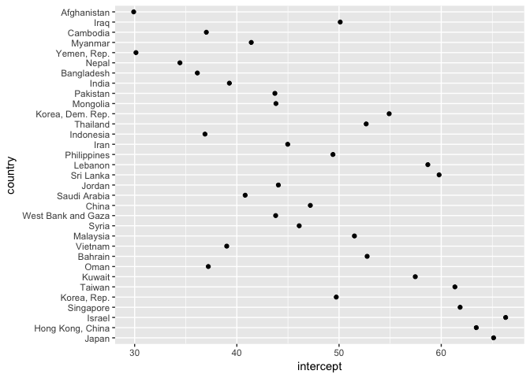
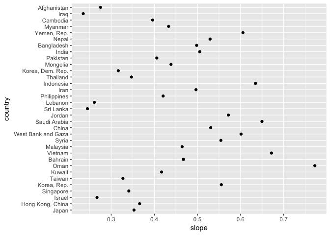
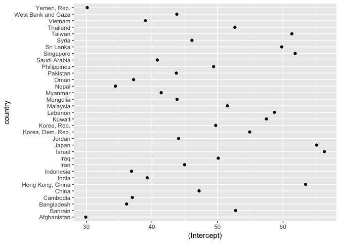

Why nesting is worth the awkwardness
================
Jenny Bryan
2018-04-10

``` r
library(gapminder)
library(tidyverse)
```

gapminder data for Asia only

``` r
gap <- gapminder %>%
  filter(continent == "Asia") %>%
  mutate(yr1952 = year - 1952)
```

``` r
ggplot(gap, aes(x = lifeExp, y = country)) +
  geom_point()
```

<!-- -->

Countries are in alphabetical order.

Set factor levels with intent. Example: order based on life expectancy
in 2007, the last year in this dataset. Imagine you want this to persist
across an entire analysis.

``` r
gap <- gap %>%
  mutate(country = fct_reorder2(country, x = year, y = lifeExp))
```

``` r
ggplot(gap, aes(x = lifeExp, y = country)) +
  geom_point()
```

<!-- -->

Much better\!

Now imagine we want to fit a model to each country and look at dot plots
of slope and intercept.

`dplyr::group_by()` + `tidyr::nest()` created a *nested data frame* and
is an alternative to splitting into country-specific data frames. Those
data frames end up, instead, in a list-column. The `country` variable
remains as a normal factor.

``` r
gap_nested <- gap %>%
  group_by(country) %>%
  nest()

gap_nested
#> # A tibble: 33 x 2
#>    country          data             
#>    <fct>            <list>           
#>  1 Afghanistan      <tibble [12 × 6]>
#>  2 Bahrain          <tibble [12 × 6]>
#>  3 Bangladesh       <tibble [12 × 6]>
#>  4 Cambodia         <tibble [12 × 6]>
#>  5 China            <tibble [12 × 6]>
#>  6 Hong Kong, China <tibble [12 × 6]>
#>  7 India            <tibble [12 × 6]>
#>  8 Indonesia        <tibble [12 × 6]>
#>  9 Iran             <tibble [12 × 6]>
#> 10 Iraq             <tibble [12 × 6]>
#> # ... with 23 more rows
gap_nested$data[[1]]
#> # A tibble: 12 x 6
#>    continent  year lifeExp      pop gdpPercap yr1952
#>    <fct>     <int>   <dbl>    <int>     <dbl>  <dbl>
#>  1 Asia       1952    28.8  8425333      779.     0.
#>  2 Asia       1957    30.3  9240934      821.     5.
#>  3 Asia       1962    32.0 10267083      853.    10.
#>  4 Asia       1967    34.0 11537966      836.    15.
#>  5 Asia       1972    36.1 13079460      740.    20.
#>  6 Asia       1977    38.4 14880372      786.    25.
#>  7 Asia       1982    39.9 12881816      978.    30.
#>  8 Asia       1987    40.8 13867957      852.    35.
#>  9 Asia       1992    41.7 16317921      649.    40.
#> 10 Asia       1997    41.8 22227415      635.    45.
#> 11 Asia       2002    42.1 25268405      727.    50.
#> 12 Asia       2007    43.8 31889923      975.    55.

gap_fitted <- gap_nested %>%
  mutate(fit = map(data, ~ lm(lifeExp ~ yr1952, data = .x)))
gap_fitted
#> # A tibble: 33 x 3
#>    country          data              fit     
#>    <fct>            <list>            <list>  
#>  1 Afghanistan      <tibble [12 × 6]> <S3: lm>
#>  2 Bahrain          <tibble [12 × 6]> <S3: lm>
#>  3 Bangladesh       <tibble [12 × 6]> <S3: lm>
#>  4 Cambodia         <tibble [12 × 6]> <S3: lm>
#>  5 China            <tibble [12 × 6]> <S3: lm>
#>  6 Hong Kong, China <tibble [12 × 6]> <S3: lm>
#>  7 India            <tibble [12 × 6]> <S3: lm>
#>  8 Indonesia        <tibble [12 × 6]> <S3: lm>
#>  9 Iran             <tibble [12 × 6]> <S3: lm>
#> 10 Iraq             <tibble [12 × 6]> <S3: lm>
#> # ... with 23 more rows
gap_fitted$fit[[1]]
#> 
#> Call:
#> lm(formula = lifeExp ~ yr1952, data = .x)
#> 
#> Coefficients:
#> (Intercept)       yr1952  
#>     29.9073       0.2753

gap_fitted <- gap_fitted %>%
  mutate(
    intercept = map_dbl(fit, ~ coef(.x)[["(Intercept)"]]),
    slope = map_dbl(fit, ~ coef(.x)[["yr1952"]])
  )
gap_fitted
#> # A tibble: 33 x 5
#>    country          data              fit      intercept slope
#>    <fct>            <list>            <list>       <dbl> <dbl>
#>  1 Afghanistan      <tibble [12 × 6]> <S3: lm>      29.9 0.275
#>  2 Bahrain          <tibble [12 × 6]> <S3: lm>      52.7 0.468
#>  3 Bangladesh       <tibble [12 × 6]> <S3: lm>      36.1 0.498
#>  4 Cambodia         <tibble [12 × 6]> <S3: lm>      37.0 0.396
#>  5 China            <tibble [12 × 6]> <S3: lm>      47.2 0.531
#>  6 Hong Kong, China <tibble [12 × 6]> <S3: lm>      63.4 0.366
#>  7 India            <tibble [12 × 6]> <S3: lm>      39.3 0.505
#>  8 Indonesia        <tibble [12 × 6]> <S3: lm>      36.9 0.635
#>  9 Iran             <tibble [12 × 6]> <S3: lm>      45.0 0.497
#> 10 Iraq             <tibble [12 × 6]> <S3: lm>      50.1 0.235
#> # ... with 23 more rows
```

``` r
ggplot(gap_fitted, aes(x = intercept, y = country)) +
  geom_point()
```

<!-- -->

``` r

ggplot(gap_fitted, aes(x = slope, y = country)) +
  geom_point()
```

<!-- -->

The `split()` + `lapply()` + `do.call(rbind, ...)` approach.

Split gap into many data frames, one per country.

``` r
gap_split <- split(gap, gap$country)
```

Fit a model to each country.

``` r
gap_split_fits <- lapply(
  gap_split,
  function(df) {
    lm(lifeExp ~ yr1952, data = df)
  }
)
#> Error in lm.fit(x, y, offset = offset, singular.ok = singular.ok, ...): 0 (non-NA) cases
```

Oops … the unused levels of country are a problem (empty data frames in
our list).

Drop unused levels in country and split.

``` r
gap_split <- split(droplevels(gap), droplevels(gap)$country)
head(gap_split, 2)
#> $Japan
#> # A tibble: 12 x 7
#>    country continent  year lifeExp       pop gdpPercap yr1952
#>    <fct>   <fct>     <int>   <dbl>     <int>     <dbl>  <dbl>
#>  1 Japan   Asia       1952    63.0  86459025     3217.     0.
#>  2 Japan   Asia       1957    65.5  91563009     4318.     5.
#>  3 Japan   Asia       1962    68.7  95831757     6577.    10.
#>  4 Japan   Asia       1967    71.4 100825279     9848.    15.
#>  5 Japan   Asia       1972    73.4 107188273    14779.    20.
#>  6 Japan   Asia       1977    75.4 113872473    16610.    25.
#>  7 Japan   Asia       1982    77.1 118454974    19384.    30.
#>  8 Japan   Asia       1987    78.7 122091325    22376.    35.
#>  9 Japan   Asia       1992    79.4 124329269    26825.    40.
#> 10 Japan   Asia       1997    80.7 125956499    28817.    45.
#> 11 Japan   Asia       2002    82.0 127065841    28605.    50.
#> 12 Japan   Asia       2007    82.6 127467972    31656.    55.
#> 
#> $`Hong Kong, China`
#> # A tibble: 12 x 7
#>    country          continent  year lifeExp     pop gdpPercap yr1952
#>    <fct>            <fct>     <int>   <dbl>   <int>     <dbl>  <dbl>
#>  1 Hong Kong, China Asia       1952    61.0 2125900     3054.     0.
#>  2 Hong Kong, China Asia       1957    64.8 2736300     3629.     5.
#>  3 Hong Kong, China Asia       1962    67.6 3305200     4693.    10.
#>  4 Hong Kong, China Asia       1967    70.0 3722800     6198.    15.
#>  5 Hong Kong, China Asia       1972    72.0 4115700     8316.    20.
#>  6 Hong Kong, China Asia       1977    73.6 4583700    11186.    25.
#>  7 Hong Kong, China Asia       1982    75.4 5264500    14561.    30.
#>  8 Hong Kong, China Asia       1987    76.2 5584510    20038.    35.
#>  9 Hong Kong, China Asia       1992    77.6 5829696    24758.    40.
#> 10 Hong Kong, China Asia       1997    80.0 6495918    28378.    45.
#> 11 Hong Kong, China Asia       2002    81.5 6762476    30209.    50.
#> 12 Hong Kong, China Asia       2007    82.2 6980412    39725.    55.
```

Fit model to each country and get `coefs()`.

``` r
gap_split_coefs <- lapply(
  gap_split,
  function(df) {
    coef(lm(lifeExp ~ yr1952, data = df))
  }
)
head(gap_split_coefs, 2)
#> $Japan
#> (Intercept)      yr1952 
#>  65.1220513   0.3529042 
#> 
#> $`Hong Kong, China`
#> (Intercept)      yr1952 
#>  63.4286410   0.3659706
```

Now we need to put everything back togethers. Row bind the list of
coefs. Coerce from matrix back to data frame.

``` r
gap_split_coefs <- as.data.frame(do.call(rbind, gap_split_coefs))
```

Restore `country` variable from row names.

``` r
gap_split_coefs$country <- rownames(gap_split_coefs)
str(gap_split_coefs)
#> 'data.frame':    33 obs. of  3 variables:
#>  $ (Intercept): num  65.1 63.4 66.3 61.8 49.7 ...
#>  $ yr1952     : num  0.353 0.366 0.267 0.341 0.555 ...
#>  $ country    : chr  "Japan" "Hong Kong, China" "Israel" "Singapore" ...
```

``` r
ggplot(gap_split_coefs, aes(x = `(Intercept)`, y = country)) +
  geom_point()
```

<!-- -->

Uh-oh, we lost the order of the `country` factor, due to coercion from
factor to character (list and then row names).

The `nest()` approach allows you to keep data as data vs. in attributes,
such as list or row names. Preserves factors and their levels or integer
variables. Designs away various opportunities for different pieces of
the dataset to get “out of sync” with each other, by leaving them in a
data frame at all times.

First in an interesting series of blog posts exploring these patterns
and asking whether the tidyverse still needs a way to include the
nesting variable in the nested data:
<https://coolbutuseless.bitbucket.io/2018/03/03/split-apply-combine-my-search-for-a-replacement-for-group_by---do/>
