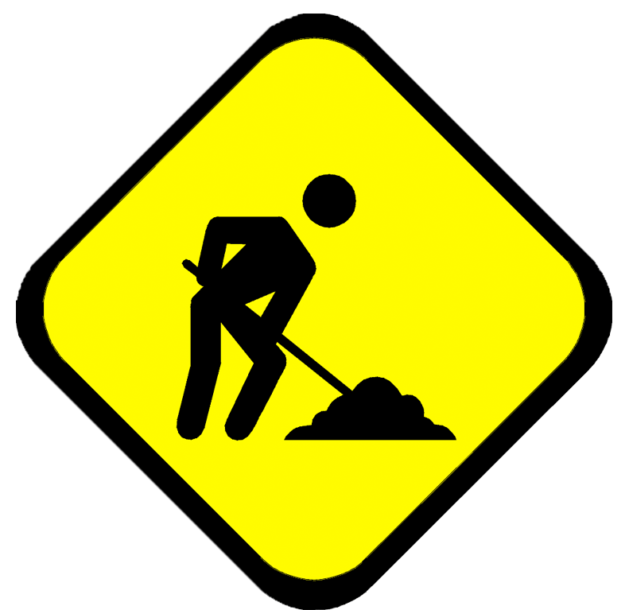
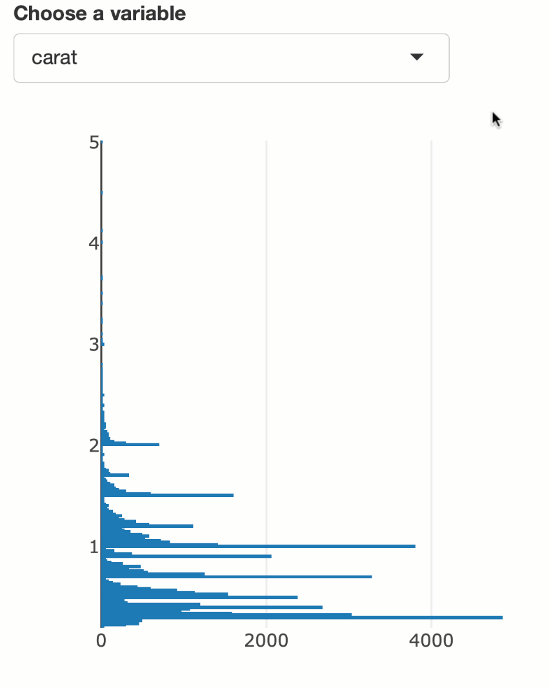
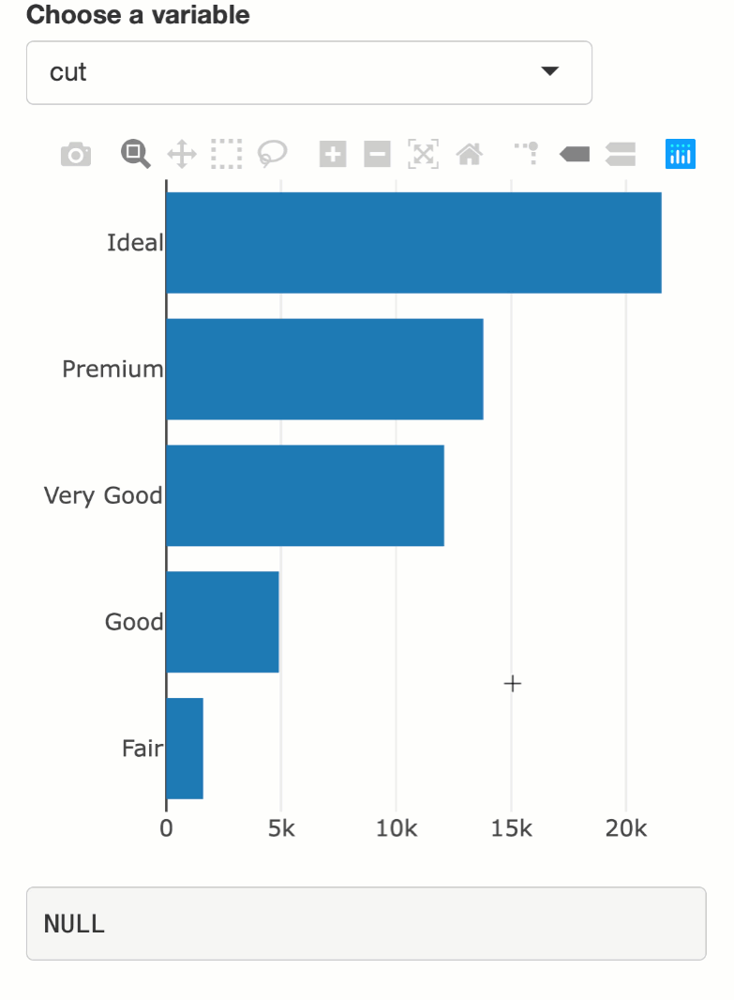
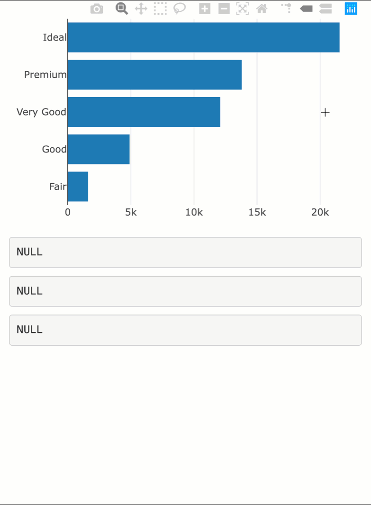
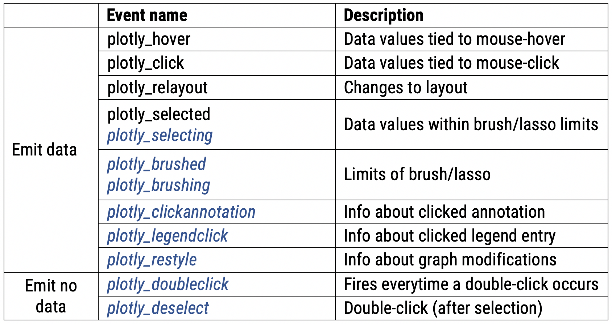
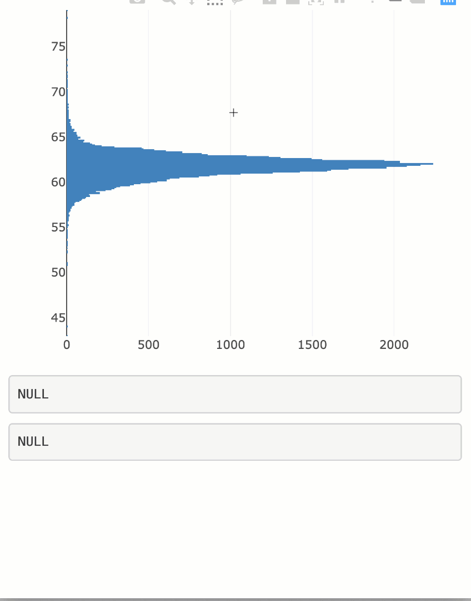

background-image: url(rstudio.svg)
background-size: 100px
background-position: 95% 5%
class: principles

### About me

* Started at RStudio in September 2018
  * Member of the **shiny** team
  * New edition of [plotly for R book](https://plotly-book.cpsievert.me) coming very soon!
  * Maintaining the **plotly** R package

* Previously freelance consultant
  * Maintained **plotly** R package (since 2015)
  * Developed **shiny** apps for exploratory visualization
  
* PhD in statistics at Iowa State (December 2016)
  * Dissertation mainly on interactive statistical graphics


```{r setup, echo = FALSE}
knitr::opts_chunk$set(
  message = FALSE,
  out.width = "70%",
  comment = "#>",
  collapse = TRUE,
  fig.align = "center"
)

include_vimeo <- function(id, width = "100%", height = "400") {
  url <- sprintf("https://player.vimeo.com/video/%s?title=0&byline=0&portrait=0", id)
  htmltools::tags$iframe(
    src = url,
    width = width,
    height = height,
    frameborder = "0",
    seamless = "seamless",
    webkitAllowFullScreen = NA,
    mozallowfullscreen = NA,
    allowFullScreen = NA
  )
}
```

---
class: middle, center

## Work in progress!



Code examples require latest GitHub version of **plotly** (CRAN release in March).

```r
remotes::install_github("ropensci/plotly")
```

---
background-image: url(rstudio.svg)
background-size: 100px
background-position: 95% 5%

### About plotly

* The R package **plotly** provides R bindings to the (MIT-licensed) JavaScript library [plotly.js](https://github.com/plotly/plotly.js).

```r
library(plotly)
plot_ly(diamonds, x = ~cut, color = ~clarity, colors = "Accent")
```

```{r, echo = FALSE}
include_vimeo("315707813")
```

---
background-image: url(rstudio.svg)
background-size: 100px
background-position: 95% 5%

### Inject more interactivity w/ shiny

.pull-left[
```r
library(shiny)

ui <- fluidPage(
  selectInput(
    "y", "Choose a variable", 
    choices = names(diamonds)
  ),
  plotlyOutput("p")
)

server <- function(input, output) {

  output$p <- renderPlotly({
    plot_ly(
      y = diamonds[[input$y]]
    )
  })
  
}

shinyApp(ui, server)
```
]

.pull-right[

]

---
background-image: url(rstudio.svg)
background-size: 100px
background-position: 95% 5%

### Some outputs can act like an input!

.pull-left[
```r
library(shiny)

ui <- fluidPage(
  selectInput(
    "y", "Choose a variable", 
    choices = names(diamonds)
  ),
  plotlyOutput("p"),
* verbatimTextOutput("hover")
)

server <- function(input, output) {
  output$p <- renderPlotly({
    plot_ly(y = diamonds[[input$y]])
  })
* output$hover <- renderPrint({
*   event_data("plotly_hover")
* })
}

shinyApp(ui, server)
```
]

.pull-right[

]

---
background-image: url(rstudio.svg)
background-size: 100px
background-position: 95% 5%

### Hover, click, & selected (old news)

.pull-left[
```r
library(shiny)

ui <- fluidPage(
  plotlyOutput("plot"),
  verbatimTextOutput("hover"),
  verbatimTextOutput("click"),
  verbatimTextOutput("selected")
)

server <- function(input, output) {
  output$plot <- renderPlotly({
    plot_ly(y = diamonds$cut)
  })
  output$hover <- renderPrint({
    event_data("plotly_hover")
  })
* output$click <- renderPrint({
*   event_data("plotly_click")
* })
* output$selected <- renderPrint({
*   event_data("plotly_selected")
* })
}

shinyApp(ui, server)
```
]

.pull-right[
 
]

---
background-image: url(rstudio.svg)
background-size: 100px
background-position: 95% 5%

### Also, the lesser known relayout

.pull-left[
```r
library(shiny)

ui <- fluidPage(
  plotlyOutput("plot"),
  verbatimTextOutput("relayout")
)

server <- function(input, output) {
  output$plot <- renderPlotly({
    plot_ly(y = diamonds$depth) %>%
      add_annotations(x = 1000, y = 70, text = "Peak!") %>%
*     config(editable = TRUE, displayModeBar = FALSE, showTips = FALSE)
  })
  output$relayout <- renderPrint({
*   event_data("plotly_relayout")
  })
}

shinyApp(ui, server)
```
]

.pull-right[
```{r, echo = FALSE}
include_vimeo("318506969", width="500")
```
]

---
background-image: url(rstudio.svg)
background-size: 100px
background-position: 95% 5%
class: inverse, middle, center

## Very powerful in combination with (editable) [layout.shapes](https://plot.ly/r/reference/#layout-shapes)!

---
background-image: url(rstudio.svg)
background-size: 100px
background-position: 95% 5%

### Responding to circle shape edits

```{r, echo = FALSE}
include_vimeo("318338029")
```

[Code](https://github.com/ropensci/plotly/blob/master/inst/examples/shiny/drag_markers/app.R) / [video](https://vimeo.com/318338029)

---
background-image: url(rstudio.svg)
background-size: 100px
background-position: 95% 5%

### Responding to line shape edits

```{r, echo = FALSE}
include_vimeo("318341222")
```

[Code](https://github.com/ropensci/plotly/blob/master/inst/examples/shiny/drag_lines/app.R) / [video](https://vimeo.com/318341222)

---
background-image: url(rstudio.svg)
background-size: 100px
background-position: 95% 5%

### A draggable brush via rect shape edits

```{r, echo = FALSE}
include_vimeo("318330112")
```

[Code](https://github.com/ropensci/plotly/blob/master/inst/examples/shiny/drag_brush/app.R) / [video](https://vimeo.com/318330112)

---
background-image: url(rstudio.svg)
background-size: 100px
background-position: 95% 5%

### Access more plotly.js events in shiny!

* __plotly__'s `event_data()` supports the following events:

<div align="center">

</div>


* <font color="#37538F"><i>Blue events</i></font> are currently available on GitHub (CRAN release coming soon)

```r
remotes::install_github("ropensci/plotly")
```


---
background-image: url(rstudio.svg)
background-size: 100px
background-position: 95% 5%

### Selecting/brushing (continuous versions of selected/brushed)

.pull-left[
```r
library(shiny)

ui <- fluidPage(
  plotlyOutput("plot"),
  verbatimTextOutput("brushing"),
  verbatimTextOutput("selecting")
)

server <- function(input, output) {
  output$plot <- renderPlotly({
    plot_ly(y = diamonds$depth)  %>%  event_register("plotly_selecting")
  })
  output$brushing <- renderPrint({
*   event_data("plotly_brushing")
  })
  output$selecting <- renderPrint({
*   event_data("plotly_selecting")
  })
}

shinyApp(ui, server)
```
]

.pull-right[
 
]

---
background-image: url(rstudio.svg)
background-size: 100px
background-position: 95% 5%

### Cross-filtering 350,000 flights

```{r, echo = FALSE}
include_vimeo("318129502")
```

[App](https://testing-apps.shinyapps.io/crossfilter/) / [Code](https://github.com/ropensci/plotly/blob/master/inst/examples/shiny/crossfilter/app.R) / [Video](https://vimeo.com/318129502)

This approach scales to about 5 million on my laptop -- could scale to much more with an optimized database.

---
background-image: url(power.gif)
background-size: 100%

---
background-image: url(power.gif)
background-size: 200px
background-position: 95% 5%
class: inverse, bottom, principles

## Brushing events need fast updates!

* General rule of thumb: responding to a brush change should take 0.1 seconds or less.
   
* Things you can do to speed things up
   * Use [profvis](https://rstudio.github.io/profvis/) to identify slow R code   
   * Cache computations whenever possible
   * *Partially modify* **plotly** graphs 
   
* If you can't perform sub-second updates, consider using `"plotly_brushed"` and/or `throttle()`/`debounce()` to delay invalidation.


---
background-image: url(rstudio.svg)
background-size: 100px
background-position: 95% 5%

### Case study: responsive linked histograms

```{r, echo = FALSE}
include_vimeo("318274579", width = 1200)
```

We'll walk through what it takes to do the following `r emo::ji("index_pointing_up")`.

This example visualizes arrival (`arr_time`) and departure (`dep_time`) times in the `flights` data from the **nycflights13** package.

---
background-image: url(rstudio.svg)
background-size: 100px
background-position: 95% 5%

### Naïve implementation

```r
library(shiny)
library(nycflights13)
ui <- fluidPage(plotlyOutput("arr_time"), plotlyOutput("dep_time"))

server <- function(input, output) {
  output$arr_time <- renderPlotly({
    plot_ly(flights, x = ~arr_time, source = "arr_time") 
  })
  
  output$dep_time <- renderPlotly({
    p <- plot_ly(flights, x = ~dep_time, source = "dep_time") 
    brush <- event_data("plotly_brushing", source = "arr_time")
    if (is.null(brush)) return(p)
    p %>%
      filter(between(arr_time, brush$x[1], brush$x[2])) %>%
      add_histogram()
  })
}

shinyApp(ui, server)
```

---
background-image: url(rstudio.svg)
background-size: 100px
background-position: 95% 5%

### Breaking down the server logic

```r
server <- function(input, output) {
  output$arr_time <- renderPlotly({
*   plot_ly(flights, x = ~arr_time, source = "arr_time") 
  })
  
  output$dep_time <- renderPlotly({
    p <- plot_ly(flights, x = ~dep_time, source = "dep_time") 
*   brush <- event_data("plotly_brushing", source = "arr_time")
    if (is.null(brush)) return(p)
    p %>%
      filter(between(arr_time, brush$x[1], brush$x[2])) %>%
      add_histogram()
  })
}
```

1. The `"dep_time"` output depends `"arr_time"` brush

---
background-image: url(rstudio.svg)
background-size: 100px
background-position: 95% 5%

### Breaking down the server logic

```r
server <- function(input, output) {
  output$arr_time <- renderPlotly({
    plot_ly(flights, x = ~arr_time, source = "arr_time") 
  })
  
  output$dep_time <- renderPlotly({
    p <- plot_ly(flights, x = ~dep_time, source = "dep_time") 
    brush <- event_data("plotly_brushing", source = "arr_time")
*   if (is.null(brush)) return(p)
    p %>%
      filter(between(arr_time, brush$x[1], brush$x[2])) %>%
      add_histogram()
  })
}
```

1. The `"dep_time"` output depends `"arr_time"` brush
2. If `"arr_time"` brush isn't active, plot full `dep_time` histogram 

---
background-image: url(rstudio.svg)
background-size: 100px
background-position: 95% 5%

### Breaking down the server logic

```r
server <- function(input, output) {
  output$arr_time <- renderPlotly({
    plot_ly(flights, x = ~arr_time, source = "arr_time") 
  })
  
  output$dep_time <- renderPlotly({
    p <- plot_ly(flights, x = ~dep_time, source = "dep_time") 
    brush <- event_data("plotly_brushing", source = "arr_time")
    if (is.null(brush)) return(p)
*   p %>%
*     filter(between(arr_time, brush$x[1], brush$x[2])) %>%
*     add_histogram()
  })
}
```

1. The `"dep_time"` output depends `"arr_time"` brush
2. If `"arr_time"` brush isn't active, plot full `dep_time` histogram 
3. If `"arr_time"` brush *is* active, plot *filtered* histogram

---

## Works reasonably well!

```{r, echo = FALSE}
include_vimeo("318277110", width = 1200)
```


* However, this approach won't scale to larger data very well
  * Also, try deploying this app and retrying w/ bad internet connection `r emo::ji("disappointed")`


---
class: inverse, middle, principles

## Why is this approach naïve?

Logic is easy to reason about, but it demonstrates two common areas for speed improvements:

1. Sends more data over-the-wire than necessary.
  * For every update, server re-sends *all* the raw data to plotly.js
    * Could, instead, perform binning server-side instead of client-side

2. Does more (client-side) rendering work then necessary.
  * When `renderPlotly()` re-executes, it does a *full redraw*.
    * Could, instead, alter just the bar heights.
    
    
---
class: inverse, middle, principles

## Why is this approach naïve?

Logic is easy to reason about, but it demonstrates two common areas for speed improvements:

1. Sends more data over-the-wire than necessary.
  * For every update, server re-sends *all* the raw data to plotly.js
    * Could, instead, perform binning server-side instead of client-side

2. Does more (client-side) rendering work then necessary.
  * When `renderPlotly()` re-executes, it does a *full redraw*.
    * Could, instead, __alter just the bar heights__.
  
---
  
### Altering *just* bar heights

```r
ui <- fluidPage(plotlyOutput("bars"))
server <- function(input, output) {
  output$bars <- renderPlotly({
    plot_ly(x = c("A", "B", "C"), y = rnorm(3)) %>%
      layout(yaxis = list(range = c(-4, 4)))
  })
  observe({
    invalidateLater(100)
    plotlyProxy("bars") %>%
      plotlyProxyInvoke("restyle", "y", list(rnorm(3)))
  })
}
```

```{r, echo = FALSE}
include_vimeo("318269936", height = 230)
```

---
  
### Altering *just* bar heights

```r
ui <- fluidPage(plotlyOutput("bars"))
server <- function(input, output) {
  output$bars <- renderPlotly({
*   plot_ly(x = c("A", "B", "C"), y = rnorm(3)) %>%
*     layout(yaxis = list(range = c(-4, 4)))
  })
  observe({
    invalidateLater(100)
    plotlyProxy("bars") %>%
      plotlyProxyInvoke("restyle", "y", list(rnorm(3)))
  })
}
```

1. Full draw performed only once (on page load).

---
  
### Altering *just* bar heights

```r
ui <- fluidPage(plotlyOutput("bars"))
server <- function(input, output) {
  output$bars <- renderPlotly({
    plot_ly(x = c("A", "B", "C"), y = rnorm(3)) %>%
      layout(yaxis = list(range = c(-4, 4)))
  })
  observe({
*   invalidateLater(100)
    plotlyProxy("bars") %>%
      plotlyProxyInvoke("restyle", "y", list(rnorm(3)))
  })
}
```

1. Full draw performed only once (on page load).
2. Every 100 milliseconds, re-run the `observe()` expression.

---
  
### Altering *just* bar heights

```r
ui <- fluidPage(plotlyOutput("bars"))
server <- function(input, output) {
  output$bars <- renderPlotly({
    plot_ly(x = c("A", "B", "C"), y = rnorm(3)) %>%
      layout(yaxis = list(range = c(-4, 4)))
  })
  observe({
    invalidateLater(100)
*   plotlyProxy("bars") %>%
*     plotlyProxyInvoke("restyle", "y", list(rnorm(3)))
  })
}
```

1. Full draw performed only once (on page load).
2. Every 100 milliseconds, re-run the `observe()` expression.
3. Invoke a plotly.js [restyle](https://plot.ly/javascript/plotlyjs-function-reference/#plotlyrestyle) on `"bars"` output with three new random values for the heights.

---
background-image: url(rstudio.svg)
background-size: 100px
background-position: 95% 5%

### Back to our crossfilter example

```{r, echo = FALSE}
include_vimeo("318274579", width = 1200)
```

Remember, our two goals:

1. Perform binning server-side instead of client-side
2. Avoid full redraw on update, just alter bar heights


---
background-image: url(rstudio.svg)
background-size: 100px
background-position: 95% 5%

### Server-side binning strategy

Compute un-filtered counts before the app starts!

```r
library(nycflights13)
library(ggstat)

arr_time <- flights$arr_time
dep_time <- flights$dep_time
arr_bins <- bin_fixed(arr_time, bins = 150)
dep_bins <- bin_fixed(dep_time, bins = 150)
arr_stats <- compute_stat(arr_bins, arr_time)
dep_stats <- compute_stat(dep_bins, dep_time)
```

---
background-image: url(rstudio.svg)
background-size: 100px
background-position: 95% 5%

### Server-side binning strategy

Compute un-filtered counts before the app starts!

```r
library(nycflights13)
*library(ggstat)

arr_time <- flights$arr_time
dep_time <- flights$dep_time
*arr_bins <- bin_fixed(arr_time, bins = 150)
*dep_bins <- bin_fixed(dep_time, bins = 150)
*arr_stats <- compute_stat(arr_bins, arr_time)
*dep_stats <- compute_stat(dep_bins, dep_time)
```

* I'm using **ggstat** because `bin_fixed()` is quite fast and simple.

  * **ggstat** currently only on [GitHub]() (use with caution)
  * [Binning with **data.table**](https://www.r-bloggers.com/using-data-table-for-binning/) is comparable, but slightly slower and more complicated.
  * Feel free to suggest better alternative for fast histogram binning!


---
background-image: url(rstudio.svg)
background-size: 100px
background-position: 95% 5%

### Server-side binning strategy

Compute un-filtered counts before the app starts!

```r
library(nycflights13)
library(ggstat)

arr_time <- flights$arr_time
dep_time <- flights$dep_time
arr_bins <- bin_fixed(arr_time, bins = 150)
dep_bins <- bin_fixed(dep_time, bins = 150)
arr_stats <- compute_stat(arr_bins, arr_time)
dep_stats <- compute_stat(dep_bins, dep_time)
```

```r
dep_stats
#> # A tibble: 242 x 3
#>    xmin_ xmax_ count_
#>    <dbl> <dbl>  <dbl>
#>  1    NA    NA   8255
#>  2    -5     5    133
#>  3     5    15    224
#>  4    15    25    162
#>  5    25    35    138
#>  6    35    45    114
#>  7    45    55     82
#>  8    55    65     28
#>  9    65    75      0
#> 10    75    85      0
#> # … with 232 more rows
```


---
background-image: url(rstudio.svg)
background-size: 100px
background-position: 95% 5%

### A glimpse of the app

```r
library(shiny)
library(nycflights13)
library(ggstat)

arr_time <- flights$arr_time
dep_time <- flights$dep_time
arr_bins <- bin_fixed(arr_time, bins = 150)
dep_bins <- bin_fixed(dep_time, bins = 150)
arr_stats <- compute_stat(arr_bins, arr_time)
dep_stats <- compute_stat(dep_bins, dep_time)

ui <- fluidPage(plotlyOutput("arr_time"), plotlyOutput("dep_time"))

server <- function(input, output) {
  
  output$arr_time <- renderPlotly({
    plot_ly(arr_stats, source = "arr_time") %>%
      add_bars(x = ~xmin_, y = ~count_)
  })
  
  output$dep_time <- renderPlotly({
    plot_ly(dep_stats, source = "dep_time") %>%
      add_bars(x = ~xmin_, y = ~count_)
  })
  
  observe({
    brush <- event_data("plotly_brushing", source = "arr_time")
    p <- plotlyProxy("dep_time")
    
    if (is.null(brush)) {
      plotlyProxyInvoke(p, "restyle", "y", list(dep_stats$count_))
    } else {
      dep_time_filter <- dep_time[between(dep_time, brush$x[1], brush$x[2])]
      dep_count <- compute_stat(dep_bins, dep_time_filter)$count_
      plotlyProxyInvoke(p, "restyle", "y", list(dep_count))
    }
  })
}

shinyApp(ui, server)
```


---
background-image: url(rstudio.svg)
background-size: 100px
background-position: 95% 5%

### Breaking down server logic

```r
server <- function(input, output) {
* output$arr_time <- renderPlotly({
*   plot_ly(arr_stats, source = "arr_time") %>% add_bars(x = ~xmin_, y = ~count_)
* })
* output$dep_time <- renderPlotly({
*   plot_ly(dep_stats, source = "dep_time") %>% add_bars(x = ~xmin_, y = ~count_)
* })
  observe({
    brush <- event_data("plotly_brushing", source = "arr_time")
    p <- plotlyProxy("dep_time")
    if (is.null(brush)) {
      plotlyProxyInvoke(p, "restyle", "y", list(dep_stats$count_))
    } else {
      dep_time_filter <- dep_time[between(dep_time, brush$x[1], brush$x[2])]
      dep_count <- compute_stat(dep_bins, dep_time_filter)$count_
      plotlyProxyInvoke(p, "restyle", "y", list(dep_count))
    }
  })
}
```

Full draw performed only once (on page load).

---
background-image: url(rstudio.svg)
background-size: 100px
background-position: 95% 5%

### Breaking down server logic

```r
server <- function(input, output) {
  output$arr_time <- renderPlotly({
    plot_ly(arr_stats, source = "arr_time") %>% add_bars(x = ~xmin_, y = ~count_)
  })
  output$dep_time <- renderPlotly({
    plot_ly(dep_stats, source = "dep_time") %>% add_bars(x = ~xmin_, y = ~count_)
  })
  observe({
*   brush <- event_data("plotly_brushing", source = "arr_time")
*   p <- plotlyProxy("dep_time")
    if (is.null(brush)) {
      plotlyProxyInvoke(p, "restyle", "y", list(dep_stats$count_))
    } else {
      dep_time_filter <- dep_time[between(dep_time, brush$x[1], brush$x[2])]
      dep_count <- compute_stat(dep_bins, dep_time_filter)$count_
      plotlyProxyInvoke(p, "restyle", "y", list(dep_count))
    }
  })
}
```

1. Changes to `arr_time` brush modify `dep_time` output

---
background-image: url(rstudio.svg)
background-size: 100px
background-position: 95% 5%

### Breaking down server logic

```r
server <- function(input, output) {
  output$arr_time <- renderPlotly({
    plot_ly(arr_stats, source = "arr_time") %>% add_bars(x = ~xmin_, y = ~count_)
  })
  output$dep_time <- renderPlotly({
    plot_ly(dep_stats, source = "dep_time") %>% add_bars(x = ~xmin_, y = ~count_)
  })
  observe({
    brush <- event_data("plotly_brushing", source = "arr_time")
    p <- plotlyProxy("dep_time")
    if (is.null(brush)) {
*     plotlyProxyInvoke(p, "restyle", "y", list(dep_stats$count_))
    } else {
      dep_time_filter <- dep_time[between(dep_time, brush$x[1], brush$x[2])]
      dep_count <- compute_stat(dep_bins, dep_time_filter)$count_
      plotlyProxyInvoke(p, "restyle", "y", list(dep_count))
    }
  })
}
```

1. Changes to `arr_time` brush modify `dep_time` output
2. If `arr_time` brush isn't active, show un-filtered counts.

---
background-image: url(rstudio.svg)
background-size: 100px
background-position: 95% 5%

### Breaking down server logic

```r
server <- function(input, output) {
  output$arr_time <- renderPlotly({
    plot_ly(arr_stats, source = "arr_time") %>% add_bars(x = ~xmin_, y = ~count_)
  })
  output$dep_time <- renderPlotly({
    plot_ly(dep_stats, source = "dep_time") %>% add_bars(x = ~xmin_, y = ~count_)
  })
  observe({
    brush <- event_data("plotly_brushing", source = "arr_time")
    p <- plotlyProxy("dep_time")
    if (is.null(brush)) {
      plotlyProxyInvoke(p, "restyle", "y", list(dep_stats$count_))
    } else {
*     dep_time_filter <- dep_time[between(dep_time, brush$x[1], brush$x[2])]
*     dep_count <- compute_stat(dep_bins, dep_time_filter)$count_
*     plotlyProxyInvoke(p, "restyle", "y", list(dep_count))
    }
  })
}
```

1. Changes to `arr_time` brush modify `dep_time` output
2. If `arr_time` brush isn't active, show un-filtered counts.
3. If `arr_time` brush *is* active, show filtered counts.

---
background-image: url(rstudio.svg)
background-size: 100px
background-position: 95% 5%

## Some reflection

* We now have the `dep_time` responding to `arr_time` brush.
  * To get `arr_time` responding to `dep_time` requires another `observe()` with *very similar* code.
  
* Orchestrating 3 (or more) views with multiple filters gets more complex.
  * Requires maintaining state of active brushes
  * See [here](https://github.com/ropensci/plotly/blob/master/inst/examples/shiny/crossfilter/app.R) and [here](https://github.com/ropensci/plotly/blob/master/inst/examples/shiny/crossfilter_compare/app.R) for examples

* _This is hard_, can you make it easier for us?
  * Maybe someday -- I want to focus on finding, [documenting](https://plotly-book.cpsievert.me/), and teaching useful patterns first

---
background-image: url(rstudio.svg)
background-size: 100px
background-position: 95% 5%

## Targetting a scatterplot

```{r, echo = FALSE}
include_vimeo("318129005")
```

[Code](https://github.com/ropensci/plotly/blob/master/inst/examples/shiny/crossfilter_scatter/app.R) / [Video](https://vimeo.com/318129005)

---
background-image: url(rstudio.svg)
background-size: 100px
background-position: 95% 5%

## Targetting a 2d density

```{r, echo = FALSE}
include_vimeo("318122403")
```

[Code](https://github.com/ropensci/plotly/blob/master/inst/examples/shiny/crossfilter_kde/app.R) / [Video](https://vimeo.com/318122403)

(Much more scalable than a scatterplot)

---
background-image: url(rstudio.svg)
background-size: 100px
background-position: 95% 5%

### Cross-filter with comparisons

```{r, echo = FALSE}
include_vimeo("307598246")
```

[Code](https://github.com/ropensci/plotly/blob/master/inst/examples/shiny/crossfilter_compare/app.R) / [Video](https://vimeo.com/307598246) / [App](https://testing-apps.shinyapps.io/crossfilter_compare)

---
background-image: url(rstudio.svg)
background-size: 100px
background-position: 95% 5%

### In summary

#### `event_data()` now supports more plotly.js events, including 'continuous' ones  like `"plotly_brushing"`

  * Currently available on GitHub `remotes::install_github("ropensci/plotly")`
  * [See here](https://github.com/ropensci/plotly/tree/master/inst/examples/shiny) for more **shiny** app examples of other events
  
#### Continous events, like `"plotly_brushing"`, require fast updates

* Be mindful of what data is sent over-the-wire
    * Perform binning/summaries server-side
    
* Consider partially modifying plots
    * Use `plotlyProxy()` to call [plotly.js functions](https://plot.ly/javascript/plotlyjs-function-reference/) inside __shiny__
    
#### Study and reuse these examples

* `plotly_example("shiny", "crossfilter")` [code](https://github.com/ropensci/plotly/tree/master/inst/examples/shiny/crossfilter) / [video](https://vimeo.com/318129502)
* `plotly_example("shiny", "crossfilter_scatter")` [code](https://github.com/ropensci/plotly/tree/master/inst/examples/shiny/crossfilter_scatter) / [video](https://vimeo.com/318129005)
* `plotly_example("shiny", "crossfilter_kde")` [code](https://github.com/ropensci/plotly/tree/master/inst/examples/shiny/crossfilter_kde) / [video](https://vimeo.com/318122403)
* `plotly_example("shiny", "crossfilter_compare")` [code](https://github.com/ropensci/plotly/tree/master/inst/examples/shiny/crossfilter_compare) / [video](https://vimeo.com/307598246)

---
background-image: url(rstudio.svg)
background-size: 90%
class: principles, center

## Thanks for listening! Questions?

<br>
<br>
<br>
<br>
<br>
<br>
<br>
<br>
<br>
<br>
<br>
<br>

Slides <https://bit.ly/shiny-plotly> <br>
`r icon::fa_twitter()` <a href="https://twitter.com/cpsievert">@cpsievert</a> <br>
`r icon::fa_github()` <a href="https://github.com/cpsievert">@cpsievert</a> <br>
`r icon::fa_envelope()` <cpsievert1@gmail.com> <br>
`r icon::fa_globe()` <https://cpsievert.me/>


