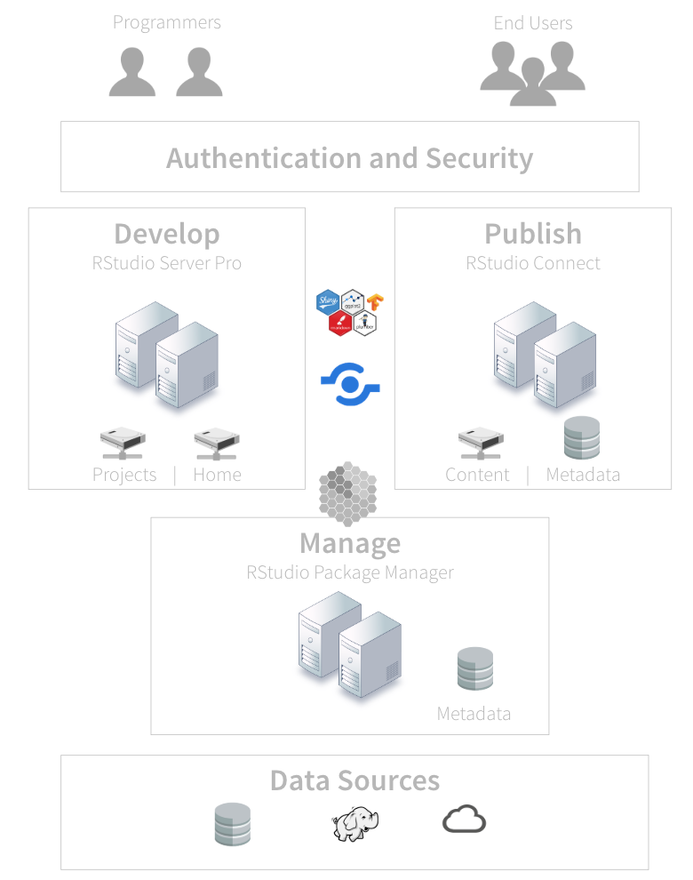
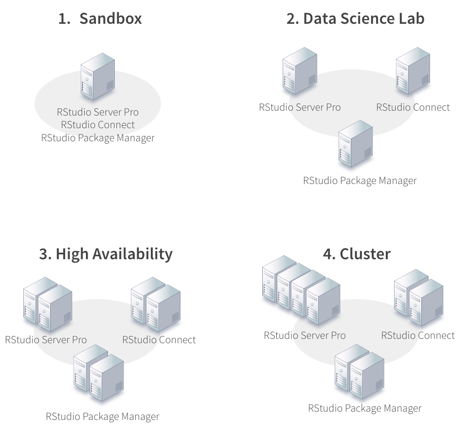

```{r setup, echo = FALSE}
library(webshot)
library(knitr)
knitr::opts_chunk$set(echo = FALSE, fig.width=8)
```

# Overview

## Solutions engineering

### We help you integrate RStudio products into your systems

### Our team

### Where do we hang out?

* [Community.rstudio.com](http://community.rstudio.com)
* [Github.com/sol-eng](http://)
* [Solutions.rstudio.com](http://solutions.rstudio.com)
* [Support.rstudio.com](http://support.rstudio.com)
* [Docs.rstudio.com](docs.rstudio.com)

## Who is this webinar for?

### R Admin -- data scientists who want to do more

### R Evangelists

### IT/Ops

### Anyone who wants to try RStudio professional products

## RStudio

### RStudio empowers individuals to be productive with data science.

* Open source and reproducible research
* APIs and interoperability
* Usability and clear documentation
* Inclusive and collective success
* Creating lasting value for data science

## What we do

### RStudio builds open source and professional software for data science

* Our professional features include things like

    * Security
    * Authentication
    * Load balancing
    * Support

### RStudio professional products

* RStudio Server Pro
* RStudio Connect
* RStudio Package Manager


## What is the relationship between R and RStudio?

### We don’t own R, package R, or distribute R

### R Core team: 20 members -- Zero from RStudio

### RStudio products "sit on top of R"

  * You standardize on R first
  * Install our products second
  
### We assume you have chosen to invest in R

## Professional R tooling and integration

### Legitimacy

* Recognize R as an analytic standard

### Competencies*

* Understand and manage R tooling

### Adoption

* Rely on integrated R based solutions

<br>

[Webinar](https://resources.rstudio.com/webinars/2018-07-11-13-00-professional-r-tooling-and-integration-nathan-stephens-1)


## Administering RStudio professional products

### People want to know if they are doing things the best way

* R is relatively unknown in most organizations
* No single place to get all the information you need
* Hard to see the forest through the trees

### We see a lot of trial and error

* Organizational hurdles
* Resource limitations

## Outline

### I want to share some best practices for managing RStudio in production

* Share product requirements
* Some tips
* A path for getting started

Goal is to give you a big picture view of what success looks like, assuming you are using RStudio professional products

# 5 Best practices for administering RStudio in production

## 1. Keep your system up to date

### Modern tools

  * Operating system
  * Browsers
    
### C++11 compiler

  * R packages on Linux must be compiled

### Internet access
  
  * R packages
    
## 2. Support multiple versions of R

### Why do you want to run multiple versions of R?

  * Manage upgrades of R
  * Test code on a variety of R versions and distributions
  * Support projects that depend on various versions of R
  * All products support multiple versions of R

### Upgrade yearly (version 3.1.0+)

### Build R from source

  * Multiple versions of R side by side requires you build R from source
  * Not hard to do (i.e. config/make/make install)
  * Most organizations have processes in place for building software
  * [Instructions](https://support.rstudio.com/hc/en-us/articles/360002242413-Multiple-versions-of-R)

## 3. Organize your R packages

### R Packages rule the nest.

* Packages will drive your R version, Linux dependencies, and even your operating system
* Data scientists will want access to their most beloved packages

### Managing packages for a single user is easy. 

* Managing packages for an entire platform is hard

### RStudio Package Manager solves several problems

* Disconnected, air-gapped environments
* Serving containers with Docker
* Curate packages into multiple repositories for security and control
* Share internal packages

### RStudio Package Manager is new

* [Demo](https://demo.rstudiopm.com/client/#/)

## 4. Use root privileges

The group in your organization that installs, configures, and manages R and RStudio will need root privileges

### RStudio products

* Installs require root privileges
* Runs require root privileges
    * RStudio Server Pro runs as the root user in order to create new R sessions on behalf of its users
    * RStudio Connect runs as the root user in order to isolate applications and processes

### R

* System-wide installations of R on Linux often involve root also

## 5. Securely manage your users

### R programmers - RStudio Server Pro

* They will need access to R, file shares, databases, and probably many other sensitive systems.
* R processes run as the user under a local account

### End users - RStudio Connect

* End users consume apps and reports.
* R Processes typically run under a service account

## Authentication

### Your organization

* Probably has strong opinions on how to authenticate users
* This space is only getting more fragmented not less
    * LDAP, Active Directory, PAM, OAuth, Okta, Duo, Auth0, etc.

### Proxied authentication

* If we don't support your specific system, then you can use our proxied authentication
* With proxied auth, users do not log in through RStudio but through a proxy that you set up

## Supported Auth Methods

### RStudio Server Pro

* PAM (LDAP and Active Directory)
* OAuth 2.0 using Google Apps
* *Proxied authentication*

### RStudio Connect

* LDAP and Active Directory
* OAuth 2.0 using Google Apps
* PAM
* SAML [Beta]
* *Proxied authentication*

## Recommendations (your Happy path)

### 1. Keep your operating systems and browsers up to date

### 2. Plan to support multiple versions of R by building R from source

### 3. Organize your R packages for reliability and consistency

### 4. Use root privileges to install and run RStudio products

### 5. Securely manage your R programmers and end users

<br>

[Summary](https://support.rstudio.com/hc/en-us/articles/360015177453-RStudio-professional-product-requirements)

# Getting Started

## Tooling

### RStudio makes software tools that are designed to work together

* Our R packages and products work together
* There are many ways to assemble our tools
* But it will be up to you to decide how to do it
* Your configuration depends on what does data science means to your organization

Our goal is to make it easy to install and configure all of our products

## Solutions

### Data science lab

### Application factories (Dev/Test/Prod)

### On premises, cloud, hybrid cloud

### Single server or a multi-departmental deployment

### Crawl, walk, run strategies

## Architecture



## Server Setup

[](https://support.rstudio.com/hc/en-us/articles/115002344588-Configuration-and-sizing-recommendations)</center>

## Recipes

### Overview

* List of ingredients that make up your platform
* Helps you organize and automate your work
* And are unique to your organization

### Structure

* Most of your code will be for Linux, R, and R packages
* A small part of your code will be for installation
* If you've installed R properly, installation is usually easy
* The rest will be configuration

### [Example checklist](https://support.rstudio.com/hc/en-us/articles/360015079054)

## Infrastructure as code

### Organize your recipes so that can manage your platform

* [Configuration management tools for the R admin](https://resources.rstudio.com/rstudio-server-pro/configuration-management-tools-for-the-r-admin)
* Ansible, Chef, Puppet, CodeDeploy, SaltStack, etc.
* Sandbox

# What if I've never used these products?

## RStudio Quickstart

### Overview

* A virtual machine that runs on your desktop
* Includes all our professional products
* And includes pre built assets for you to explore and demonstrate to others

### Motivation

* Experience RStudio professional products
* Free and easy

[Demo](https://www.rstudio.com/products/quickstart/)

## Summary

### The happy path

* Keep your operating system and browser up to date
* Support multiple versions of R by building R from source
* Make sure you have easy access to R packages
* Install products as root
* Use a supported authentication system

### How to get started

* Recipes and [checklists](https://support.rstudio.com/hc/en-us/articles/360015079054)
* Crawl/Walk/Run strategies
* Using a sandbox
* [RStudio QuickStart](https://www.rstudio.com/products/quickstart/)

## Summary

### Connecting with solutions engineering

* [Community.rstudio.com](https://community.rstudio.com/)
* [Github.com/sol-eng](http://)
* [Solutions.rstudio.com](http://solutions.rstudio.com)
* [Support.rstudio.com](http://support.rstudio.com)
* [Docs.rstudio.com](docs.rstudio.com)

## References

[Administration of Pro Products](https://resources.rstudio.com/administration-of-pro-products)

[Professional R Tooling and Integration](https://resources.rstudio.com/webinars/2018-07-11-13-00-professional-r-tooling-and-integration-nathan-stephens-1)

[The R Admin is Rad](https://resources.rstudio.com/rstudio-conf-2018/the-r-admin-is-rad-a-guide-to-professional-r-tooling-and-integration-nathan-stephens)

[R Admin Community](https://community.rstudio.com/c/r-admin)

[RStudio Docs](https://docs.rstudio.com/resources.html)

[RStudio Professional Product Requirements](https://support.rstudio.com/hc/en-us/articles/360015177453-RStudio-professional-product-requirements)

[RStudio Server Pro Example Checklist](https://support.rstudio.com/hc/en-us/articles/360015079054-RStudio-Server-Pro-Installation-and-Configuration-Example-Checklist)

[R for the Enterprise](https://rviews.rstudio.com/categories/r-for-the-enterprise/)

[Configuration Management Tools for the R Admin](https://resources.rstudio.com/rstudio-server-pro/configuration-management-tools-for-the-r-admin)


