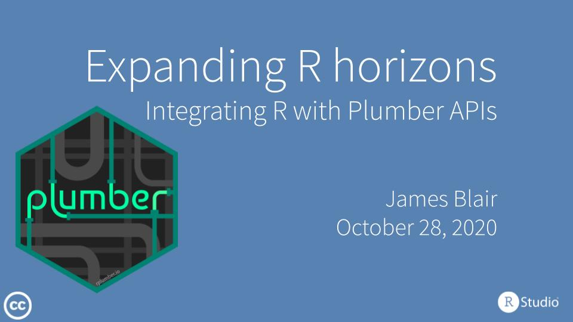

<!-- README.md is generated from README.Rmd. Please edit that file -->

# Plumber Webinar

[](slides/slides.pdf)

This webinar highlights using [Plumber](https://www.rplumber.io/) to
solve a common set of data science problems while also highlighting
features added in version 1.0.0 of the Plumber package.

## Environment

This project uses [`renv`](https://rstudio.github.io/renv/index.html)
for package management. In order to install and use required packages,
execute the following:

``` r
renv::restore()
```
